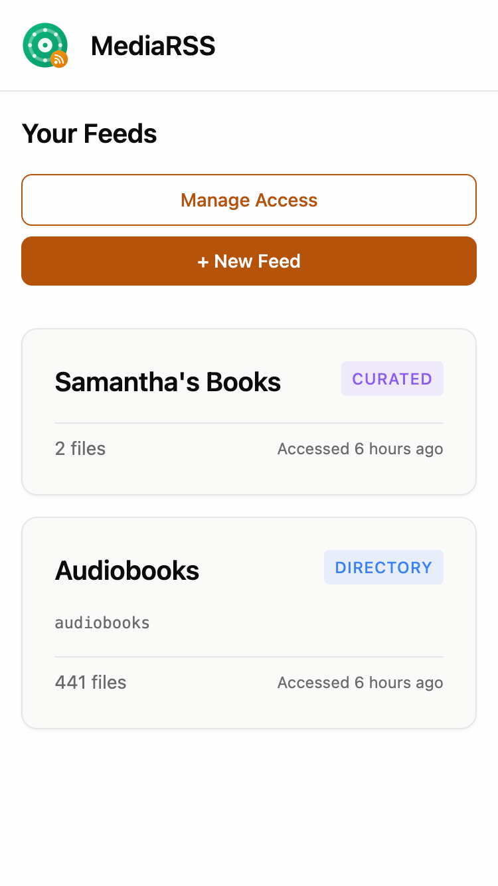
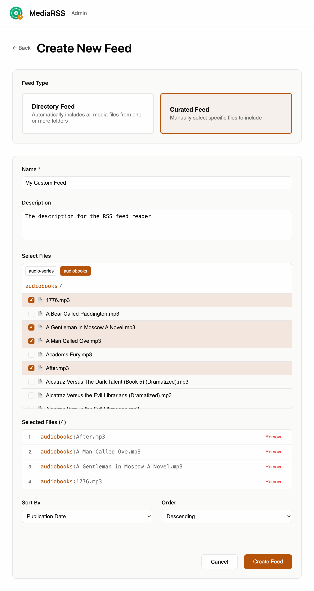
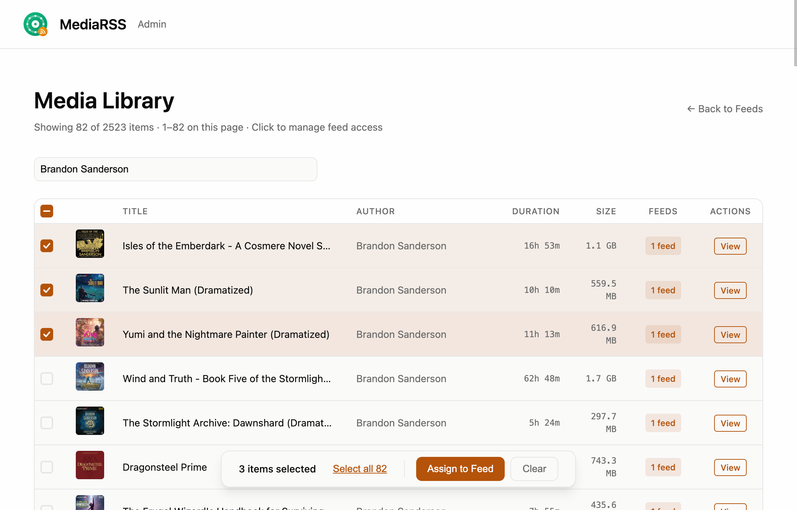
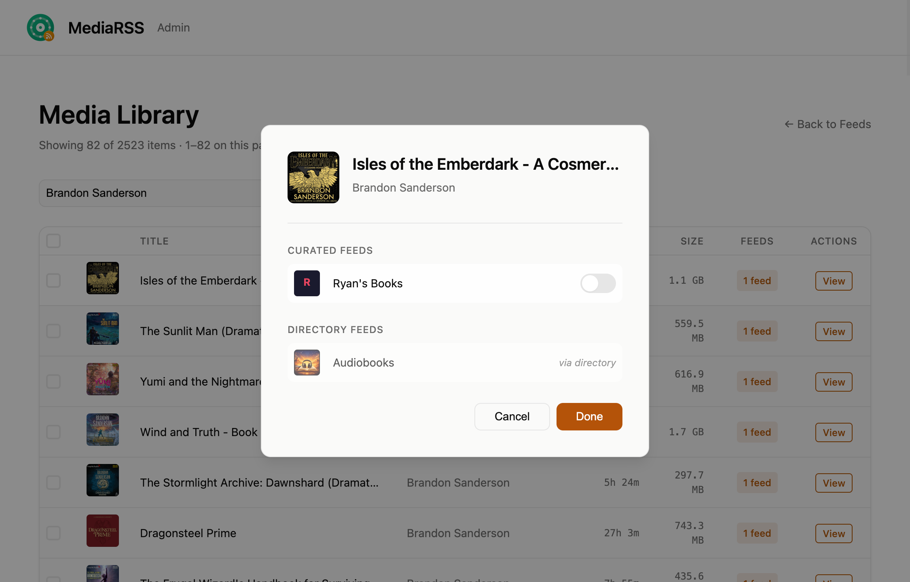
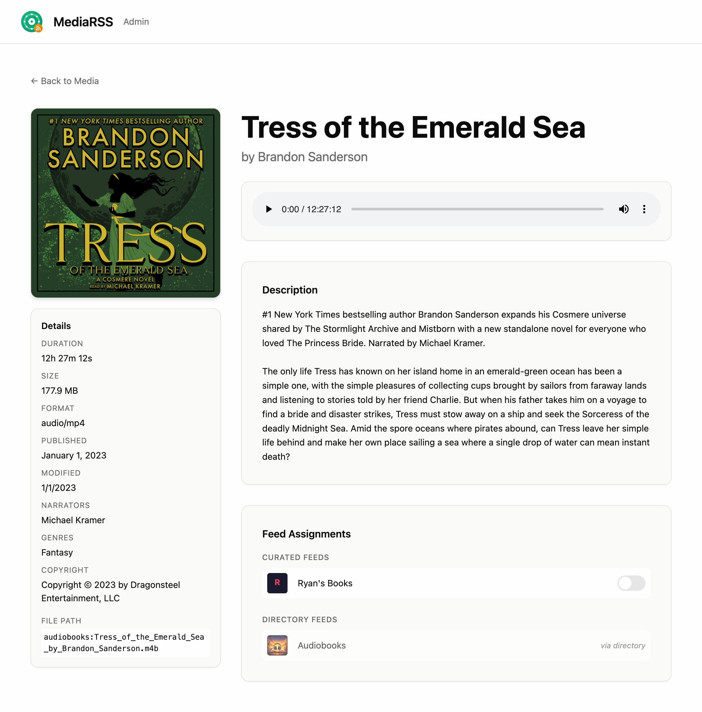

# MediaRSS

<div align="center">
  <h1 align="center">MediaRSS</h1>
  <strong align="center">
    An RSS feed generator for audio files (audiobooks, podcasts, audio series).
  </strong>
</div>

> **Note:** While MediaRSS is primarily designed and tested for audio files
> (MP3, M4A, M4B, etc.), video files should also work. However, video support
> is not the primary focus and may have limitations (especially with regard to
> performance) with certain formats.

## Screenshots

### Dashboard



### Feed Details


### Create Feed



### Media Library





### Media Details



## Self-Hosting

### Prerequisites

- Docker
- A server or machine to host the application
- Basic understanding of Docker volumes for data persistence
- Media files organized in one or more directories on your host machine
- (Recommended) A domain name and Cloudflare account for secure remote access
  (see [Securing the Admin Dashboard](#securing-the-admin-dashboard))

### Synology NAS Setup

If you're running this on a Synology NAS, follow these specific instructions:

1. Install Docker from the Synology Package Center if you haven't already.

2. Create a shared folder for the database files:

   - Open Control Panel → Shared Folder
   - Create a new shared folder named `docker-data` (or your preferred name)
   - Inside this folder, create a directory called `mediarss`

3. Note your media locations:

   - Synology typically stores media files in `/volume1/[shared-folder-name]`
   - You can mount any number of media directories from your Synology

4. Open Docker in Synology DSM:

   - Go to "Registry" and search for the mediarss image
   - Download the image
   - Go to "Container" and launch using the image

5. When setting up the container in the Synology Docker UI:

   - In the "Advanced Settings" → "Volume" tab:
     - Add a volume mount for the database:
       - Mount path: `/data`
       - Local path: `/volume1/docker-data/mediarss`
     - Add a volume mount for artwork (to persist uploaded feed images):
       - Mount path: `/app/data/artwork`
       - Local path: `/volume1/docker-data/mediarss/artwork`
     - Add your media volume mounts (add as many as you need):
       - Mount path: `/media/[your-name]` (e.g., `/media/shows`,
         `/media/personal`, etc.)
       - Local path: `/volume1/[your-folder]`
       - Check "Read-only"
   - In the "Port Settings" tab:

     - Local Port: 22050 (or your preferred port)
     - Container Port: 22050 (or whatever you set PORT to in the env settings)

   - In the "Environment" tab:
     - Add the standard environment variables as needed
     - For multiple media paths, specify them in MEDIA_PATHS:
       - Variable: MEDIA_PATHS
       - Value: `shows:/media/shows,personal:/media/personal`
       - Format: `name:path,name:path` (comma-separated, each with a name and
         path)

The rest of the standard instructions apply for managing the container.

### Quick Start Script

For the easiest setup, use the provided NAS setup script:

1. Copy `scripts/nas-setup.sh` to your NAS
2. Edit the configuration section at the top of the script
3. Run it:

```bash
chmod +x nas-setup.sh
./nas-setup.sh
```

The script will pull the latest image, set up the container with your media
directories, and configure automatic restarts.

### Manual Setup (Non-Synology)

1. Pull the Docker image:

```bash
docker pull [your-image-name]
```

2. Create directories for persistent storage and ensure your media directories
   exist:

```bash
# Create directories for database and artwork storage
mkdir -p /path/to/your/data
mkdir -p /path/to/your/data/artwork

# Your media directories should already exist
```

3. Run the container:

```bash
docker run -d \
  --name mediarss \
  -p 22050:22050 \
  -v /path/to/your/data:/data \
  -v /path/to/your/data/artwork:/app/data/artwork \
  -v /path/to/audiobooks:/media/audiobooks:ro \
  -v /path/to/audio-series:/media/audio-series:ro \
  -e MEDIA_PATHS=audiobooks:/media/audiobooks,audio-series:/media/audio-series \
  [your-image-name]
```

Note: The `:ro` flag in the media volume mounts makes them read-only, which is
recommended for security.

### Volume Mounts

The application requires these volume mounts:

1. **Database Volume** (`/data`):

   - Purpose: Stores SQLite databases
   - Mount point: `/data`
   - Example: `-v /path/to/your/data:/data`

2. **Artwork Volume** (`/app/data/artwork`):

   - Purpose: Stores uploaded feed artwork images
   - Mount point: `/app/data/artwork`
   - Example: `-v /path/to/your/data/artwork:/app/data/artwork`
   - **Important:** Without this mount, uploaded artwork will be lost on container
     restart

3. **Media Volumes** (any number allowed):
   - Purpose: Access to your audio files
   - Mount point pattern: `/media/[your-name]`
   - Examples:
     - `-v /path/to/audiobooks:/media/audiobooks:ro`
     - `-v /path/to/audio-series:/media/audio-series:ro`
   - Should be mounted read-only (`:ro`)
   - Name the mount points anything that makes sense for your use case

### Media Directory Structure

You can organize your media directories however you prefer. Here's an example
structure for audiobooks and audio series:

```
/media/audiobooks/
├── fiction/
│   ├── Harry Potter Series/
│   └── Lord of the Rings/
└── non-fiction/
    ├── Atomic Habits/
    └── Deep Work/

/media/audio-series/
├── podcasts/
│   ├── show1/
│   └── show2/
└── courses/
    ├── course1/
    └── course2/
```

### Environment Variables

The following environment variables can be configured:

- `PORT`: Server port (default: 22050)
- `NODE_ENV`: Environment mode (`production`, `development`, or `test`)
- `DATABASE_PATH`: Path to the main SQLite database (default: ./data/sqlite.db)
- `CACHE_DATABASE_PATH`: Path to the cache SQLite database (default:
  ./data/cache.db)
- `MEDIA_PATHS`: Named media roots in format `name:path,name:path`
  - Example: `shows:/media/shows,personal:/media/personal,other:/media/other`
  - Each media root has a name (used in URLs) and a path (filesystem location)
  - **Names must be unique** - duplicate names are not allowed
  - Names should be URL-safe (alphanumeric, hyphens, underscores)

### Securing the Admin Dashboard

MediaRSS has two types of routes:

- **Public routes** (`/feed/*`, `/media/*`, `/art/*`) - These are accessed by RSS
  readers and podcast apps. They use secret tokens in URLs for access control.
- **Admin routes** (`/`) - The dashboard for managing feeds. This should be
  protected.

Since RSS readers need direct access to feed URLs without authentication prompts,
we recommend using **Cloudflare Tunnel** to secure the admin dashboard rather
than app-level authentication.

#### Why Cloudflare Tunnel?

- **Free HTTPS** - Automatic SSL certificates, no configuration needed
- **No port forwarding** - Outbound-only connection, your router stays locked down
- **Hidden IP** - Your home IP address is never exposed
- **Access policies** - Add authentication at the edge (email OTP, SSO, etc.)
- **Works with any DNS** - You don't need to move your domain to Cloudflare

#### Setting Up Cloudflare Tunnel

1. **Create a free Cloudflare account** and add your domain (you can use the free
   plan).

2. **Create a tunnel** in the Zero Trust dashboard:
   - Go to **Networks → Tunnels → Create a tunnel**
   - Name it (e.g., "mediarss")
   - Choose **Docker** as the connector
   - Copy the tunnel token

3. **Run cloudflared** alongside MediaRSS on your NAS/server:

   ```bash
   docker run -d \
     --name cloudflared \
     --restart unless-stopped \
     --network host \
     cloudflare/cloudflared:latest \
     tunnel run --token YOUR_TUNNEL_TOKEN
   ```

   > **Note:** The `--network host` flag is required so that cloudflared can reach
   > MediaRSS via `localhost`. Without it, `localhost` would refer to the
   > cloudflared container itself, not your NAS.

4. **Configure the public hostname** in the tunnel settings:
   - Hostname: `media.yourdomain.com` (a domain name you control)
   - Service: `http://localhost:22050` (or your MediaRSS port)

5. **Add an Access policy** to protect the admin dashboard:
   - Go to **Access → Applications → Add an application**
   - Choose "Self-hosted"
   - Set the domain to `media.yourdomain.com`
   - Set the path to `/admin` (just the admin pages)
   - Add an authentication method (email OTP is easiest)
   - **Important:** Don't protect `/feed/*`, `/media/*`, or `/art/*` paths

#### Using Cloudflare Tunnel Without Moving DNS

If your domain's DNS is managed elsewhere (not Cloudflare), you can still use
Cloudflare Tunnel with a CNAME record:

1. Complete steps 1-4 above
2. Find your tunnel's hostname in the Cloudflare dashboard - it looks like:
   `a1b2c3d4-e5f6-7890-abcd-ef1234567890.cfargotunnel.com`
3. At your DNS provider, create a CNAME record:
   ```
   media.yourdomain.com  CNAME  <tunnel-uuid>.cfargotunnel.com
   ```

**Note:** This only works for subdomains (e.g., `media.yourdomain.com`), not the
root domain.

#### Alternative: Local Network Only

If you only access MediaRSS from your local network and don't need remote
access, you can skip Cloudflare Tunnel entirely. The token-based URLs for feeds
provide sufficient security for trusted networks.

### Data Persistence

The application stores persistent data in two locations:

**Databases** (in `/data`):

- Main database: `/data/sqlite.db`
- Cache database: `/data/cache.db`

**Uploaded Artwork** (in `/app/data/artwork`):

- Feed cover images uploaded through the admin dashboard

To ensure your data persists between container restarts and updates, you
**must** mount volumes to both `/data` and `/app/data/artwork` as shown in the
run command above.

### Backup and Restore

To backup your data, simply copy the files from your mounted data directory. For
example:

```bash
# Stop the container before backup
docker stop mediarss

# Backup the databases and artwork
cp /path/to/your/data/sqlite.db /path/to/backup/sqlite.db
cp /path/to/your/data/cache.db /path/to/backup/cache.db
cp -r /path/to/your/data/artwork /path/to/backup/artwork

# Restart the container
docker start mediarss
```

To restore from backup:

```bash
# Stop the container
docker stop mediarss

# Restore the databases and artwork
cp /path/to/backup/sqlite.db /path/to/your/data/sqlite.db
cp /path/to/backup/cache.db /path/to/your/data/cache.db
cp -r /path/to/backup/artwork /path/to/your/data/artwork

# Restart the container
docker start mediarss
```

### Upgrading

To upgrade to a new version:

```bash
# Pull the new image
docker pull [your-image-name]

# Stop the current container
docker stop mediarss

# Remove the old container
docker rm mediarss

# Run the new container (using the same data directory and media mount)
docker run -d \
  --name mediarss \
  -p 22050:22050 \
  -v /path/to/your/data:/data \
  -v /path/to/your/data/artwork:/app/data/artwork \
  -v /path/to/audiobooks:/media/audiobooks:ro \
  -v /path/to/audio-series:/media/audio-series:ro \
  -e MEDIA_PATHS=audiobooks:/media/audiobooks,audio-series:/media/audio-series \
  [your-image-name]
```

Your data will be preserved as long as you use the same volume mount points.

## Alternatives

[Audiobookshelf](https://github.com/advplyr/audiobookshelf) is a fully featured
audio media server. It doesn't support private RSS feeds and it's a little too
much for what I want, so I built my own thing. But you might like it.
